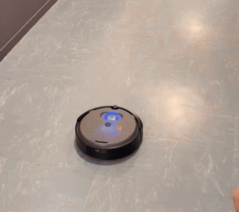

# Robot de surveillance autonome — iRobot Create 3

Un robot mobile qui patrouille seul, repère ce qui se trouve sur son chemin et décide s'il s'agit d'un **obstacle** à contourner ou d'un **intrus** à suivre. Développé en ROS 2 et testé sur un vrai robot iRobot Create 3.

<!-- Remplacer par le GIF de démo (voir la section "Vidéos") -->

*Le robot attend sans bouger. Dès qu'un « intrus » passe devant ses capteurs infrarouges, il le détecte et le suit.*

> Projet de Master 1 MoSIG (Université Grenoble Alpes) — UE Introduction à la robotique, avril 2026.
> Équipe de 4 : **Alexandre Gauchier**, Elouann Marfil, Matthys Borel, Mateo Da Cunha.
> 📑 [Slides de la présentation](Comportement_Autonome_Slide_Pres.pdf)

---

## Fonctionnalités

| Fonctionnalité | Description |
|---|---|
| **Patrouille autonome** | Le robot se déplace seul. Dès qu'il détecte quelque chose, il s'en approche, s'arrête et observe : si l'objet bouge, il le suit ; s'il reste immobile 3 s, il le classe comme obstacle et l'évite. |
| **Suivi d'objet** | Suit un objet en mouvement devant lui grâce aux capteurs infrarouges frontaux, et s'arrête s'il en est trop proche. |
| **Retour au dock** | Mémorise sa position après l'undock, y retourne par odométrie, s'aligne face à la base puis lance le docking natif du Create 3. |
| **Undock / Dock** | Utilise les actions natives du Create 3. |
| **Contrôle manuel** | Pilotage au clavier avec les flèches. |
| **Retours lumineux et sonores** | L'anneau de LEDs et des séquences sonores indiquent l'état du robot. |
| **Mapping** *(inachevé)* | Suivi de mur par capteurs IR. Commencé mais non finalisé faute de temps : il reste instable, voir [Difficultés](#difficultés-rencontrées). |

---

## Zoom : obstacle ou intrus ?

C'est le cœur du comportement de patrouille. Le robot ne dispose que de capteurs infrarouges de proximité : pour distinguer un obstacle d'un intrus, il **observe si l'objet bouge**.

```
PATROL_FORWARD ──(objet détecté)──► PATROL_FOLLOW ──(trop proche)──► PATROL_INSPECT
      ▲                                    ▲                              │
      │                                    └────────(l'objet bouge)───────┤
      │                                                                   │
PATROL_COOLDOWN ◄──(recul + rotation aléatoire)── PATROL_AVOID ◄──(immobile 3 s)
```

| État | Rôle |
|---|---|
| `FORWARD` | Avance en cherchant un objet |
| `FOLLOW` | S'approche de l'objet détecté |
| `INSPECT` | S'arrête et observe si l'intensité IR varie (= l'objet bouge) |
| `AVOID` | Recule puis tourne aléatoirement |
| `COOLDOWN` | Avance un court instant sans détection pour ne pas re-détecter le même obstacle |

---

## Architecture

Le contrôleur est une **machine à états finis (FSM)** exécutée à 20 Hz dans un seul node ROS 2. Chaque comportement est isolé dans sa propre classe, et les transitions sont centralisées dans un module dédié.

```
REST ──────────────────────────────────────────────────┐
UNDOCK → REST                                          │
DOCK → REST                                            │
                                                       │
MAPPING_FORWARD → MAPPING_TURN_RIGHT                   │
MAPPING_TURN_RIGHT → MAPPING_FOLLOW_WALL               │
MAPPING_FOLLOW_WALL → MAPPING_TURN_RIGHT               │
                                                       │
FOLLOW_OBJECT → REST (timeout)                         │
                                                       │
PATROL_FORWARD → PATROL_FOLLOW                         │
PATROL_FOLLOW → PATROL_INSPECT / PATROL_COOLDOWN       │
PATROL_INSPECT → PATROL_FOLLOW / PATROL_AVOID          │
PATROL_AVOID → PATROL_COOLDOWN                         │
PATROL_COOLDOWN → PATROL_FORWARD                       │
                                                       │
BACK_TO_HOME → BACK_TO_PREDOCK → DOCK ─────────────────┘
```

### Interface ROS 2

| Topic / action Create 3 | Type | Utilisé par |
|---|---|---|
| `ir_intensity` | Subscriber | `IRSensor` |
| `odom` | Subscriber | `BackToHome`, transitions |
| `cmd_vel` | Publisher | Tous les behaviors |
| `cmd_lightring` | Publisher | `LightController` |
| `audio_note_sequence` | Action client | `SoundController` |
| `dock` / `undock` | Action client | `DockBehavior` |

### Structure du code

```
src/robot_controller/robot_controller/
├── robot_controller_node.py   # Node principal, boucle FSM à 20 Hz
├── states.py                  # Enum des états du FSM
├── transitions.py             # Logique de transitions entre états
├── config.py                  # Seuils et vitesses centralisés
├── ir_sensors.py              # Abstraction des capteurs IR
├── keyboard.py                # Saisie clavier (thread séparé)
├── light.py                   # Contrôleur LEDs
├── sound.py                   # Contrôleur audio
└── behaviors/
    ├── base.py                # Classe parente des behaviors
    ├── dock.py                # Dock / Undock (actions natives Create 3)
    ├── mapping.py             # Mapping par suivi de mur
    ├── follow.py              # Suivi d'objet
    ├── patrol.py              # Patrouille autonome
    ├── manual.py              # Contrôle manuel
    └── back_to_home.py        # Retour au dock
```

---

## Difficultés rencontrées

**La détection IR dépend de la surface.** Les capteurs infrarouges du Create 3 mesurent la lumière réfléchie : un mur blanc est bien détecté, un mur sombre beaucoup moins, voire pas du tout. La couleur, la matière et la luminosité ambiante changeaient donc fortement les valeurs mesurées. C'est ce qui explique les échecs du mapping visibles dans les vidéos `sans_son_MappingBugged*.mp4` : face à une surface sombre, le robot ne « voit » pas le mur. La vidéo `sans_son_DifferenceMurClairEtSombre.mp4` montre la différence directement.

**Un mapping inachevé.** Le suivi de mur a été commencé mais n'a pas pu être finalisé dans le temps imparti. En plus de la sensibilité aux surfaces sombres, il souffrait d'une sortie prématurée des virages : le robot quittait la rotation avant d'être réaligné avec le mur. Nous avons préféré concentrer le temps restant sur la patrouille, le suivi et le retour au dock.

**Calibration.** Les seuils de détection (`config.py`) ont été ajustés empiriquement, par essais successifs sur le robot, pour chaque comportement.

**Pas de simulation exploitable.** La simulation n'étant pas fonctionnelle, tout a été développé et testé directement sur le robot physique, pendant les créneaux de cours. Cela a limité le temps de test et imposé d'itérer vite.

---

## Limites et pistes d'amélioration

- **Remplacer ou compléter les capteurs IR par une caméra**, pour ne plus dépendre de la couleur des surfaces.
- **Planifier les trajectoires de patrouille** (patrouille par secteur) plutôt qu'une exploration aléatoire.
- **Finaliser le mapping** : fiabiliser le suivi de mur, puis tester un balayage de type boustrophédon.
- **Construire une vraie carte** (grille d'occupation) et éviter les obstacles pendant le retour au dock.
- **Alerter en cas d'intrus** et ne pas le perdre (encerclement, poursuite).
- **Multi-robots** : coordination de plusieurs robots de surveillance.
- Le namespace du robot (`/Robot3`) est actuellement codé en dur dans le code.

---

## Vidéos

Une vidéo par fonctionnalité se trouve dans le dossier [`video/`](video/) : patrouille, suivi, retour au dock, dock/undock, contrôle manuel, et les tests de mapping sur surfaces claires et sombres.

---

## Installation et lancement

**Prérequis :** un iRobot Create 3, un PC sous Linux avec Docker, et une image Docker ROS 2 Iron (pendant le projet, nous utilisions l'image `ros-iron-cyclone` fournie en cours).

> ⚠️ Le code utilise le namespace `/Robot3` (nom de notre robot). Si ton robot porte un autre nom, remplace `/Robot3` dans les fichiers du dossier `robot_controller/` (topics et actions).

### 1. Connecter le robot au réseau

1. Allumer le robot et maintenir les deux boutons appuyés quelques secondes pour passer en mode configuration.
2. Connecter le PC au point d'accès WiFi créé par le robot (`Create-XXXX`).
3. Ouvrir `192.168.10.1` dans un navigateur pour accéder à l'interface du robot, puis :
   - le connecter au même réseau WiFi que le PC (`<SSID>` / `<mot de passe>`) ;
   - vérifier son nom (namespace) et son **ROS Domain ID**.
4. Reconnecter le PC à ce réseau WiFi.
5. Vérifier que le robot est visible depuis ROS 2 :
   ```bash
   export ROS_DOMAIN_ID=<domain_id_du_robot>
   ros2 topic list
   ```
   Les topics du robot (par exemple `/Robot3/cmd_vel`) doivent apparaître. Cela peut prendre quelques secondes.

### 2. Lancer le conteneur Docker

```bash
docker run -it --net=host --privileged \
    --volume=${HOME}/ros2_ws:/root/ros2_ws \
    --env="DISPLAY=$DISPLAY" \
    --volume="${XAUTHORITY}:/root/.Xauthority" \
    <image_ros2_iron> bash
```

`--net=host` permet au conteneur de communiquer avec le robot sur le réseau, et le volume monte ton workspace `~/ros2_ws` dans le conteneur.

### 3. Récupérer le projet

Sur le PC (hors du conteneur), dans le workspace monté :

```bash
cd ~/ros2_ws
git clone https://github.com/AlexandreGhr/robot-surveillance-create3.git
```

### 4. Compiler et lancer

Dans le conteneur :

```bash
source /opt/ros/iron/setup.bash
cd ~/ros2_ws/robot-surveillance-create3
colcon build
source install/setup.bash
export ROS_DOMAIN_ID=<domain_id_du_robot>
ros2 run robot_controller robot_controller_node
```

Le robot démarre dans l'état `REST`. Utilise ensuite les touches ci-dessous (commence par `u` pour l'undock).

### Nettoyer le build

```bash
rm -rf build/ install/ log/
```

### Contrôles clavier

| Touche | Action |
|--------|--------|
| `u` | Undock |
| `d` | Dock |
| `r` | Repos (arrêt) |
| `p` | Patrouille |
| `f` | Suivi d'objet |
| `h` | Retour au dock |
| `m` | Mapping (suivi de mur) |
| `i` | Mode manuel |
| `↑ ↓ ← →` | Déplacement (mode manuel) |
| `Ctrl+C` | Arrêt du programme |

### Paramètres principaux (`config.py`)

| Paramètre | Valeur | Rôle |
|-----------|--------|------|
| `DETECTION_THRESHOLD` | 35 | Seuil IR avant pour détecter un objet |
| `CLOSE_THRESHOLD` | 1800 | Seuil IR « trop proche » |
| `PATROL_MOVE_THRESHOLD` | 50 | Variation IR à partir de laquelle l'objet est considéré en mouvement |
| `PATROL_INSPECT_DURATION` | 3.0 s | Temps d'observation avant de classer un objet comme obstacle |
| `PATROL_AVOID_DURATION` | 2.5 s | Durée de la manœuvre d'évitement |
| `PATROL_COOLDOWN_DURATION` | 1.0 s | Temps sans détection avant de reprendre la patrouille |
| `OBSTACLE_FRONT` / `WALL_LEFT` | 400 / 250 | Seuils IR du mapping |
